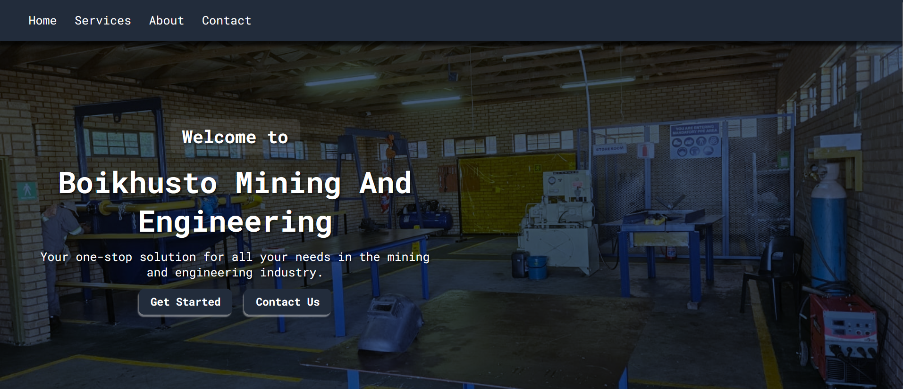
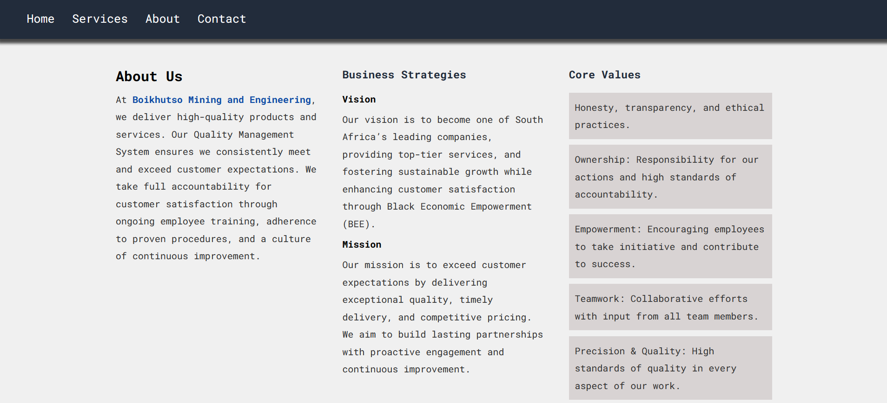
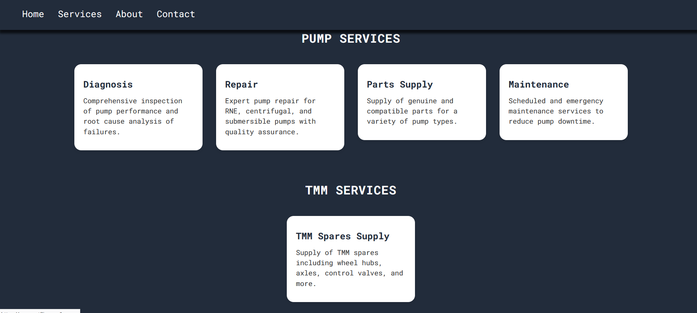
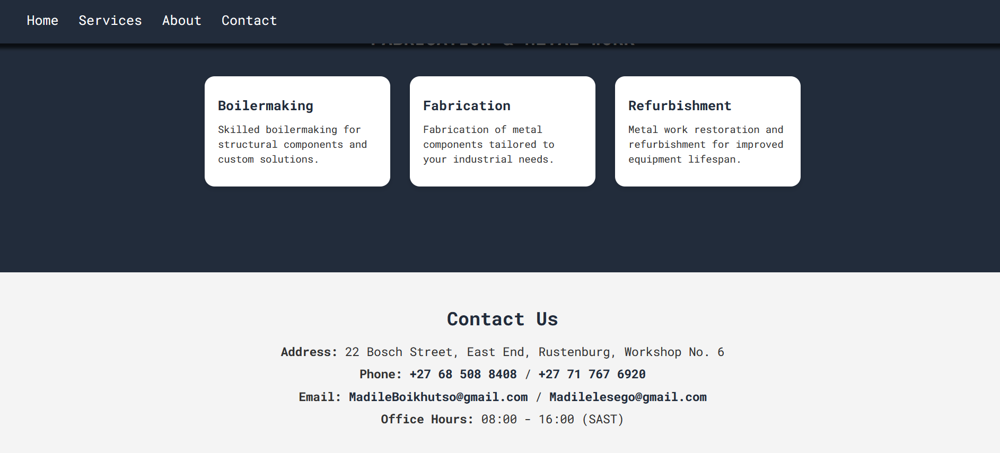

# Engineering Company Website

A fully responsive, static website designed for a small engineering company specializing in pump repairs, TMM spares, and metalwork. The project focuses on creating a clean, professional online presence that effectively showcases the company's core services.

## Preview

  
  
  
  

## 🌟 Project Goals

The website was built with the following goals in mind:

- **Highlight Core Services**: Clearly split and explain the main services offered under Pumps, TMM, and Boilermaking/Metalwork.
- **Improve SEO**: Ensure the site is optimized for search engines using semantic HTML and meaningful metadata.
- **Responsive Design**: Make the website fully responsive and visually consistent across desktop, tablet, and mobile devices.
- **Professional Aesthetic**: Use a modern, clean layout with a dark-blue and white color palette to reflect professionalism and trust.
- **User Friendly**: Easy navigation with hover effects and visual hierarchy that make it easy to understand what the company does at a glance.

## 🧰 Tech Stack

- **HTML5** – for semantic structure and SEO-friendly content
- **CSS3** – for layout, styling, and animations (no frameworks used)
- **Responsive Design** – using media queries to adapt to different screen sizes

## 📌 Features

- **Sticky Navigation Bar** with hover animation
- **Hero Section** with company intro and background image
- **Services Section** split into:
  - 🛠️ **Pumps**: Diagnosis, Repair, Parts Supply, Maintenance (RNE, Centrifugal, Submersible)
  - ⚙️ **TMM**: Supply of TMM Spares (wheel hubs, axles, control valves, etc.)
  - 🔧 **Boilermaking & Fabrication**: Metal work and refurbishment
- **About Section** with company background
- **Contact Section** with styled clickable email and phone
- **Mobile Responsive Design** for phones and tablets

## 🔍 SEO Best Practices Used

- Descriptive `<title>` and meta tags
- Semantic elements like `<header>`, `<section>`, `<nav>`, `<footer>`
- Keyword-rich headings and descriptions

## 📱 Responsiveness

- Optimized for:
  - Tablets (portrait and landscape)
  - Desktops and larger displays
- Flexbox and media queries are used to dynamically adjust layout and spacing

## 🚀 Future Improvements

- Add animations or scroll-based transitions
- Add a mobile hamburger menu
- Connect a contact form with email functionality

---

**Designed and built with passion to represent a hardworking engineering company.**
